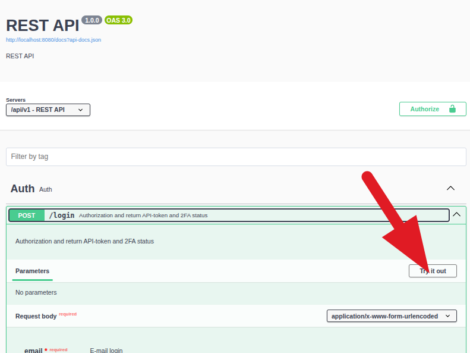
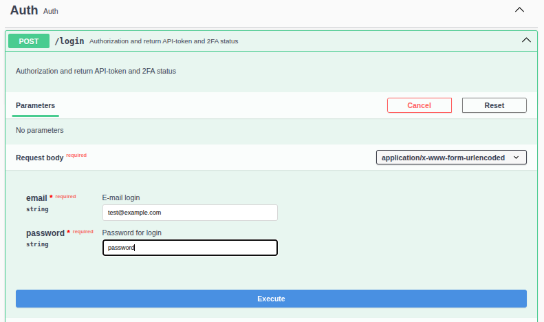
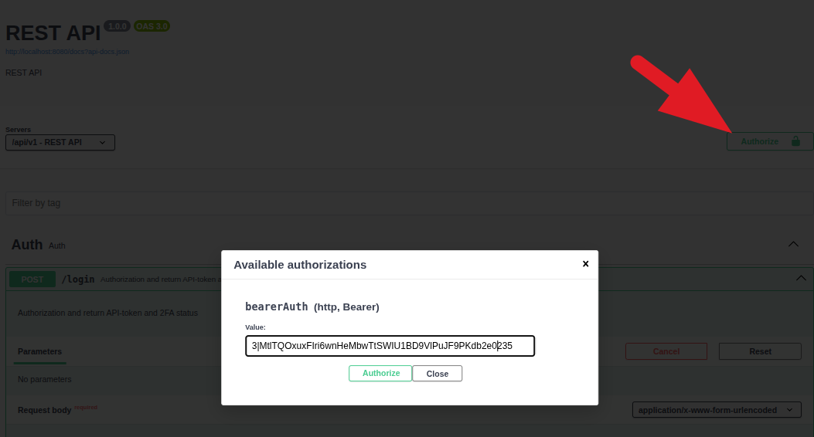

# The example of REST API with Laravel 13 with 2fa, php 8.5

This is an example of REST API with Laravel 13 with 2fa, for learning purposes. Use DTO and Repository patterns for index().  I will be glad to see your pull requests.

<!-- TOC -->
  * [Installation](#installation)
  * [Work with Swagger UI](#work-with-swagger-ui)
  * [MySQL console](#mysql-console)
  * [The sequence of the authorization in case of the 2fa](#the-sequence-of-the-authorization-in-case-of-the-2fa-)
    * [How to display the QR code in the browser when local testing/](#how-to-display-the-qr-code-in-the-browser-when-local-testing)
  * [Unit testing of the REST API](#unit-testing-of-the-rest-api)
  * [Learning the REST API](#learning-the-rest-api)
<!-- TOC -->

## Installation

1. Clone this repository (https://github.com/bibrkacity/rest-example-13-2fa.git) and `cd` into root folder ( *your-path*/rest-example-13)
2. Copy `.env.example` to `.env`
3. Run `composer install`
4. Run `./vendor/bin/sail up`
5. Run `./vendor/bin/sail artisan migrate`
6. Run `./vendor/bin/sail artisan db:seed`
7. Run `php artisan l5-swagger:generate`

Now you can visit the Swagger UI at http://127.0.0.1:8000/api/docs 

## Work with Swagger UI

First, you need to log in with `test@example.com` and `password`:
1. Dropdown menu -> Auth, then click `Login`:
   
2. Click **Try it out** and enter credentials:
   
3. Copy token in clipboard:
   
4. Click `Authorize` in the top-right area of the page and paste token:
   
5. Click `Authorize` in a popup window

Now you can use Swagger UI to test your API.

## MySQL console

run `./vendor/bin/sail mysql` to open MySQL console. 

Also, you can use `mysql -h0.0.0.0 -P3307 -uroot -p` (password `Password1234`) to connect to MySQL.

## The sequence of the authorization in case of the 2fa 

So the user requires 2fa authorization (the `required2fa` column in the `users` table is `1`)

1. The API client gets the Sanctum token from the route `/api/v1/login`
2. If the user has not enabled 2fa (the `google2fa_enabled` column in the `users` table is `0`), the API client gets the QR code from the route `/api/v1/auth/enable-2fa` and displays it to the user (person).
   The user scans the QR code with Google Authenticator app and enters the code from the Google Authenticator to the route `/api/v1/auth/verify-2fa`. If the code is correct, the user gets the enabled 2fa for next login and the Sanctum session variable `verified2fa`.
3. If the user has enabled 2fa (the `google2fa_enabled` column in the `users` table is `1`), the API client gets the code from the user (the user gets it from the Google Authenticator app) to the route `/api/v1/auth/verify-2fa-login`. It this code is correct, the user gets the Sanctum session variable `verified2fa`.

The Sanctum token and the user's Sanctum session variable `verified2fa` grant to the API client the access to endpoints that require 2fa-authorization.

### How to display the QR code in the browser when local testing/

The simplest way to display the QR code in the browser is to create file `qr.html` wuth contents like this:
```html

```
and put the value of the field `qrCodeInline` of the response from the route `/api/v1/auth/enable-2fa` in the `src` attribute of the `img` tag. Now you can open the file `qr.html` in the browser.
 
## Unit testing of the REST API

Run `php artisan test` to run unit tests for the REST API endpoints.

## Learning the REST API

1. [REST API URI Naming Conventions and Best Practices](https://restfulapi.net/resource-naming/)
2. [REST API Tutorial](https://www.restapitutorial.com)


